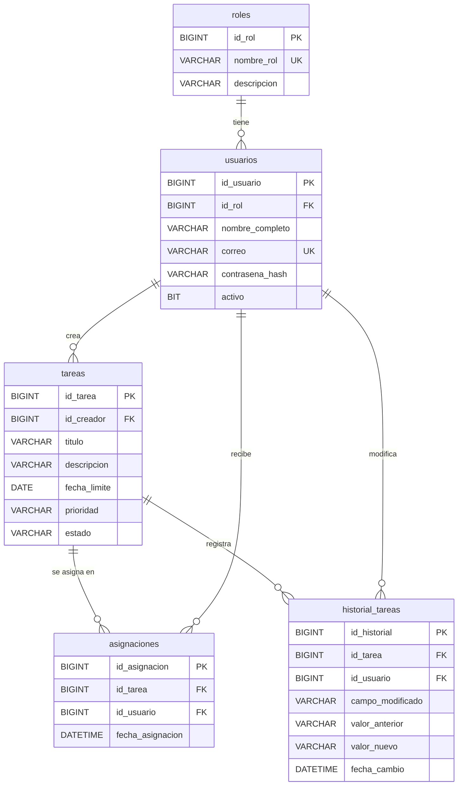

# Gestor de Tareas — Plásticos Sostenibles

API REST para la **gestión de tareas** dentro de una organización, donde un
**administrador** gestiona y asigna las tareas de cada uno de sus **colaboradores
(empleados)**. Construida con Java + Spring Boot y base de datos MySQL.

> **Estado:** en desarrollo. Ya funcionan el esquema de base de datos (versionado
> con Flyway) y el módulo de **autenticación** (registro + login con JWT).
> Ver [Estado del proyecto](#estado-del-proyecto).

---

## Tabla de contenido
1. [Requisitos del sistema (funcionales)](#requisitos-del-sistema-funcionales)
2. [Stack tecnológico](#stack-tecnológico)
3. [Dependencias / librerías](#dependencias--librerías)
4. [Arquitectura del sistema](#arquitectura-del-sistema)
5. [Estructura del proyecto](#estructura-del-proyecto)
6. [Modelo de datos (base de datos)](#modelo-de-datos-base-de-datos)
7. [Seguridad: autenticación y autorización](#seguridad-autenticación-y-autorización)
8. [API — Endpoints](#api--endpoints)
9. [Migraciones de base de datos (Flyway)](#migraciones-de-base-de-datos-flyway)
10. [Requisitos previos e instalación](#requisitos-previos-e-instalación)
11. [Cómo ejecutar](#cómo-ejecutar)
12. [Configuración](#configuración)
13. [Estado del proyecto](#estado-del-proyecto)

---

## Requisitos del sistema (funcionales)

- **Registro de usuarios** proporcionando: nombre completo, correo electrónico,
  contraseña y confirmación de contraseña.
- **Autenticación** de usuarios (login) y control de acceso a los recursos.
- **Roles**:
  - `ADMINISTRADOR`: gestiona las tareas de sus colaboradores.
  - `COLABORADOR`: empleado que ejecuta las tareas asignadas.
- **Tareas**: creación de tareas con título, descripción, fecha límite, prioridad
  y estado; cada tarea tiene un usuario creador.
- **Asignaciones**: una tarea puede asignarse a uno o varios colaboradores, con su
  fecha de asignación.
- **Historial / auditoría**: registro de los cambios realizados sobre una tarea
  (qué campo cambió, valor anterior y nuevo, quién y cuándo).

---

## Stack tecnológico

| Herramienta | Versión | Rol |
|---|---|---|
| **Java (JDK)** | 17 (17.0.14 LTS) | Lenguaje / runtime |
| **Spring Boot** | 4.1.0 | Framework de aplicación |
| **Spring Framework** | 7.x | Núcleo (IoC, MVC, Security) |
| **Apache Maven** | 3.9.11 | Gestión de dependencias y build |
| **MySQL Server** | 8.0.46 (Oracle) | Base de datos relacional |
| **Hibernate ORM** | 7.4.1 | Mapeo objeto-relacional (JPA) |
| **Apache Tomcat** | 11 (embebido) | Servidor web / servlet |
| **Flyway** | 12.4.0 | Migraciones de base de datos |
| **JJWT** | 0.12.6 | Generación/validación de tokens JWT |

> **Nota sobre la base de datos:** durante el desarrollo inicial se usó el MySQL que
> trae **XAMPP** (que en realidad es **MariaDB 10.4**), pero se migró a un **MySQL 8
> de Oracle independiente**, instalado como servicio de Windows (`MySQL80`) que
> arranca automáticamente y escucha en el puerto **3306**.

---

## Dependencias / librerías

Definidas en [`pom.xml`](pom.xml):

| Dependencia | Para qué |
|---|---|
| `spring-boot-starter-web` | API REST (controladores, Tomcat, JSON) |
| `spring-boot-starter-data-jpa` | Persistencia con JPA / Hibernate |
| `mysql-connector-j` | Driver JDBC de MySQL |
| `spring-boot-starter-validation` | Validación de datos de entrada (Bean Validation) |
| `spring-boot-starter-security` | Autenticación y autorización (incluye BCrypt) |
| `io.jsonwebtoken:jjwt-api / jjwt-impl / jjwt-jackson` | Tokens JWT (HS512) |
| `spring-boot-flyway` + `flyway-core` + `flyway-mysql` | Migraciones versionadas |
| `spring-boot-starter-test` | Pruebas |

> ⚠️ **Particularidad de Spring Boot 4:** las autoconfiguraciones se modularizaron.
> Para integraciones como Flyway ya no basta con la librería de terceros
> (`flyway-core`): hay que añadir además el módulo de Spring Boot que trae su
> autoconfiguración (`spring-boot-flyway`).

---

## Arquitectura del sistema

Arquitectura en **capas (patrón MVC)** sobre una API REST *stateless*:

```
Cliente (HTTP/JSON + JWT)
        │
        ▼
┌───────────────────┐   Controlador (C): endpoints REST, recibe/valida peticiones
│   controller/     │
└─────────┬─────────┘
          ▼
┌───────────────────┐   Servicio: lógica de negocio, transacciones, seguridad
│   service/ (impl) │
└─────────┬─────────┘
          ▼
┌───────────────────┐   Repositorio: acceso a datos (Spring Data JPA)
│   repository/     │
└─────────┬─────────┘
          ▼
┌───────────────────┐   Modelo (M): entidades JPA (mapeo a tablas) + DTOs
│   model/entity    │
│   model/dto       │
└───────────────────┘

Transversales:
  security/    → filtro JWT, servicio de tokens, punto de entrada 401
  config/      → SecurityConfig, PasswordEncoder
  exception/   → manejo global de errores (respuestas HTTP consistentes)
```

- **Sin estado (stateless):** no hay sesión en el servidor; la identidad viaja en un
  **token JWT** que el cliente envía en cada petición.
- **Base de datos externa:** los datos viven en el servidor MySQL, **no** dentro del
  proyecto. El proyecto solo contiene la *definición* del esquema (migraciones Flyway)
  y las entidades.

---

## Estructura del proyecto

```
Gestor-de-tareas-pl-sticos-sustentables/
├── pom.xml
├── README.md
└── src/
    ├── main/
    │   ├── java/com/gestortareas/
    │   │   ├── GestorTareasApplication.java     # clase principal (@SpringBootApplication)
    │   │   ├── config/
    │   │   │   ├── PasswordEncoderConfig.java    # bean BCrypt
    │   │   │   └── SecurityConfig.java           # cadena de seguridad (JWT, rutas públicas/protegidas)
    │   │   ├── controller/
    │   │   │   └── AuthController.java           # /api/auth/registro, /api/auth/login
    │   │   ├── service/
    │   │   │   ├── AuthService.java
    │   │   │   └── impl/
    │   │   │       ├── AuthServiceImpl.java      # registro + login
    │   │   │       └── UsuarioDetailsService.java# carga usuarios para Spring Security
    │   │   ├── repository/
    │   │   │   ├── UsuarioRepository.java
    │   │   │   └── RolRepository.java
    │   │   ├── model/
    │   │   │   ├── entity/                       # Rol, Usuario, Tarea, Asignacion, HistorialTarea
    │   │   │   └── dto/                          # RegistroRequest, UsuarioResponse, LoginRequest, LoginResponse
    │   │   ├── security/
    │   │   │   ├── JwtService.java               # genera/valida tokens
    │   │   │   ├── JwtAuthenticationFilter.java  # autentica por header Authorization
    │   │   │   └── JwtAuthenticationEntryPoint.java # respuesta 401
    │   │   └── exception/
    │   │       ├── GlobalExceptionHandler.java
    │   │       ├── CorreoYaRegistradoException.java
    │   │       └── ContrasenasNoCoincidenException.java
    │   └── resources/
    │       ├── application.properties
    │       └── db/migration/
    │           ├── V1__esquema_inicial.sql
    │           └── V2__datos_iniciales_roles.sql
    └── test/
        └── java/com/gestortareas/
```

---

## Modelo de datos (base de datos)

**Base de datos:** `gestion_tareas` (charset `utf8mb4`, collation `utf8mb4_unicode_ci`).
El esquema lo administran las [migraciones Flyway](#migraciones-de-base-de-datos-flyway).

### Diagrama entidad-relación



### Tablas

#### `roles`
| Columna | Tipo | Restricciones | Descripción |
|---|---|---|---|
| `id_rol` | BIGINT | PK, AUTO_INCREMENT | Identificador |
| `nombre_rol` | VARCHAR(50) | NOT NULL, UNIQUE | `ADMINISTRADOR` / `COLABORADOR` |
| `descripcion` | VARCHAR(255) | NULL | Descripción del rol |

#### `usuarios`
| Columna | Tipo | Restricciones | Descripción |
|---|---|---|---|
| `id_usuario` | BIGINT | PK, AUTO_INCREMENT | Identificador |
| `id_rol` | BIGINT | NOT NULL, FK → `roles(id_rol)` | Rol del usuario |
| `nombre_completo` | VARCHAR(150) | NOT NULL | Nombre |
| `correo` | VARCHAR(150) | NOT NULL, UNIQUE | Correo (usuario de login) |
| `contrasena_hash` | VARCHAR(255) | NOT NULL | Hash BCrypt (nunca texto plano) |
| `activo` | BIT(1) | NOT NULL | Usuario habilitado/deshabilitado |

#### `tareas`
| Columna | Tipo | Restricciones | Descripción |
|---|---|---|---|
| `id_tarea` | BIGINT | PK, AUTO_INCREMENT | Identificador |
| `id_creador` | BIGINT | NOT NULL, FK → `usuarios(id_usuario)` | Quién creó la tarea |
| `titulo` | VARCHAR(200) | NOT NULL | Título |
| `descripcion` | VARCHAR(1000) | NULL | Descripción |
| `fecha_limite` | DATE | NULL | Fecha límite |
| `prioridad` | VARCHAR(20) | NULL | Prioridad |
| `estado` | VARCHAR(30) | NOT NULL | Estado de la tarea |

#### `asignaciones` (tabla puente Tarea ↔ Usuario)
| Columna | Tipo | Restricciones | Descripción |
|---|---|---|---|
| `id_asignacion` | BIGINT | PK, AUTO_INCREMENT | Identificador |
| `id_tarea` | BIGINT | NOT NULL, FK → `tareas(id_tarea)` | Tarea asignada |
| `id_usuario` | BIGINT | NOT NULL, FK → `usuarios(id_usuario)` | Colaborador asignado |
| `fecha_asignacion` | DATETIME(6) | NOT NULL | Fecha/hora de asignación |

#### `historial_tareas` (auditoría)
| Columna | Tipo | Restricciones | Descripción |
|---|---|---|---|
| `id_historial` | BIGINT | PK, AUTO_INCREMENT | Identificador |
| `id_tarea` | BIGINT | NOT NULL, FK → `tareas(id_tarea)` | Tarea modificada |
| `id_usuario` | BIGINT | NOT NULL, FK → `usuarios(id_usuario)` | Quién hizo el cambio |
| `campo_modificado` | VARCHAR(100) | NOT NULL | Campo que cambió |
| `valor_anterior` | VARCHAR(1000) | NULL | Valor previo |
| `valor_nuevo` | VARCHAR(1000) | NULL | Valor nuevo |
| `fecha_cambio` | DATETIME(6) | NOT NULL | Fecha/hora del cambio |

> Existe además la tabla `flyway_schema_history`, creada y gestionada automáticamente
> por Flyway para llevar el registro de las migraciones aplicadas.

---

## Seguridad: autenticación y autorización

- **Contraseñas**: se almacenan con **hash BCrypt**; nunca en texto plano.
- **Sesión stateless con JWT**: el login devuelve un token firmado (HS512); el cliente
  lo envía en el header `Authorization: Bearer <token>` en cada petición.
- **Rutas públicas**: `/api/auth/**` (registro y login) y `/error`.
  **El resto requiere token válido.**
- **Roles como autoridades**: el rol se expone como `ROLE_ADMINISTRADOR` /
  `ROLE_COLABORADOR`. Ya está habilitado `@EnableMethodSecurity` para autorización por
  método (`@PreAuthorize`) en el siguiente paso.
- Al **auto-registrarse**, el usuario recibe por defecto el rol `ADMINISTRADOR`.

### Flujo
1. `POST /api/auth/registro` → crea el usuario (contraseña hasheada).
2. `POST /api/auth/login` → valida credenciales y devuelve el **token JWT**.
3. El cliente usa `Authorization: Bearer <token>` para acceder a recursos protegidos.

---

## API — Endpoints

| Método | Ruta | Público | Descripción |
|---|---|---|---|
| `POST` | `/api/auth/registro` | ✅ | Registro de usuario |
| `POST` | `/api/auth/login` | ✅ | Login; devuelve token JWT |
| *(resto)* | `/api/**` | 🔒 | Requiere `Authorization: Bearer <token>` |

### Registro
```http
POST /api/auth/registro
Content-Type: application/json

{
  "nombreCompleto": "Ana Pérez",
  "correo": "ana@empresa.com",
  "contrasena": "secreta123",
  "confirmacionContrasena": "secreta123"
}
```
**201 Created**
```json
{ "id": 1, "nombreCompleto": "Ana Pérez", "correo": "ana@empresa.com", "rol": "ADMINISTRADOR", "activo": true }
```

### Login
```http
POST /api/auth/login
Content-Type: application/json

{ "correo": "ana@empresa.com", "contrasena": "secreta123" }
```
**200 OK**
```json
{ "token": "eyJhbGciOiJIUzUxMiJ9...", "tipo": "Bearer", "expiraEnMs": 86400000 }
```

### Respuestas de error (formato consistente)
| Situación | Código |
|---|---|
| Validación de campos / contraseñas no coinciden | `400` |
| Credenciales inválidas (login) | `401` |
| Acceso a recurso protegido sin token válido | `401` |
| Correo ya registrado | `409` |

```json
{ "timestamp": "...", "estado": 400, "error": "Bad Request", "mensaje": "...", "errores": { "correo": "..." } }
```

---

## Migraciones de base de datos (Flyway)

El esquema **no** se genera con Hibernate, sino con **scripts SQL versionados** en
[`src/main/resources/db/migration/`](src/main/resources/db/migration). Hibernate solo
**valida** que las tablas coincidan con las entidades (`spring.jpa.hibernate.ddl-auto=validate`).

| Script | Contenido |
|---|---|
| `V1__esquema_inicial.sql` | Crea las 5 tablas con claves foráneas |
| `V2__datos_iniciales_roles.sql` | Siembra los roles `ADMINISTRADOR` y `COLABORADOR` |

**Reglas de trabajo con migraciones:**
- Cada cambio de esquema es un **script nuevo** (`V3__...`, `V4__...`), aplicado en orden.
- Las migraciones **ya aplicadas no se editan** (Flyway valida su checksum).

---

## Requisitos previos e instalación

- **Java JDK 17**
- **Maven 3.9+**
- **MySQL Server 8.x** corriendo en `localhost:3306`

Crear la base de datos y el usuario de la aplicación (una sola vez):
```sql
CREATE DATABASE IF NOT EXISTS gestion_tareas
  CHARACTER SET utf8mb4 COLLATE utf8mb4_unicode_ci;

CREATE USER IF NOT EXISTS 'gestor'@'localhost' IDENTIFIED BY 'Gestor2026';
GRANT ALL PRIVILEGES ON gestion_tareas.* TO 'gestor'@'localhost';
FLUSH PRIVILEGES;
```
> Las **tablas** las crea Flyway automáticamente al arrancar la aplicación.

---

## Cómo ejecutar

```bash
# Desde la carpeta del proyecto (donde está el pom.xml)
mvn spring-boot:run
```
La aplicación queda disponible en **http://localhost:8080**. Al arrancar:
1. Flyway aplica las migraciones pendientes (crea tablas + siembra roles).
2. Hibernate valida el esquema.
3. Tomcat escucha en el puerto 8080.

Compilar / empaquetar:
```bash
mvn clean package        # genera el .jar en target/
```

---

## Configuración

Archivo [`src/main/resources/application.properties`](src/main/resources/application.properties):

```properties
server.port=8080

# MySQL (usuario dedicado 'gestor')
spring.datasource.url=jdbc:mysql://localhost:3306/gestion_tareas?useSSL=false&allowPublicKeyRetrieval=true&serverTimezone=UTC
spring.datasource.username=gestor
spring.datasource.password=********

# JPA / Hibernate: el esquema lo maneja Flyway; Hibernate solo valida
spring.jpa.hibernate.ddl-auto=validate

# Flyway
spring.flyway.enabled=true

# JWT
app.jwt.secret=********
app.jwt.expiration-ms=86400000
```

> 🔒 **Seguridad:** la contraseña de BD y el secreto JWT están hoy en texto plano en
> `application.properties` (aceptable para desarrollo local). Para producción deben
> **externalizarse** (variables de entorno) y rotarse.

---

## Estado del proyecto

### ✅ Completado
- Estructura del proyecto (Spring Boot + arquitectura MVC por capas).
- Modelo de datos: entidades JPA y esquema en MySQL (migraciones Flyway).
- Base de datos MySQL 8 independiente como servicio de Windows.
- Módulo de **autenticación**: registro + login con JWT y BCrypt.
- Manejo global de errores con respuestas HTTP consistentes.

### 🚧 Pendiente (siguientes pasos)
- **Autorización por rol** (`@PreAuthorize`) diferenciando `ADMINISTRADOR` / `COLABORADOR`.
- **CRUD de Tareas** (crear, listar, actualizar, cambiar estado).
- **Asignación** de tareas a colaboradores.
- **Historial/auditoría** automático de cambios en tareas.
- Capa de **vista** (frontend o plantillas) — por definir.
- Externalizar secretos (BD y JWT) y afinar la configuración para producción.
